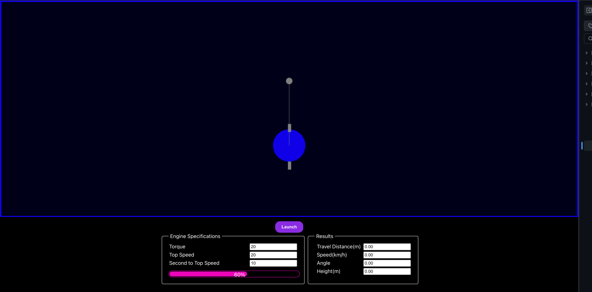
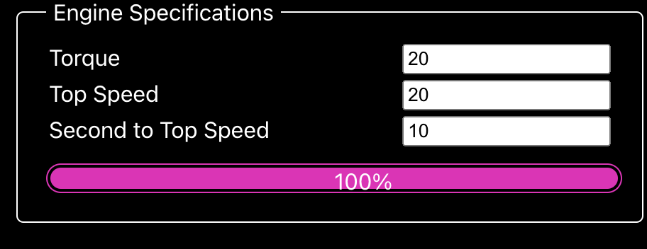
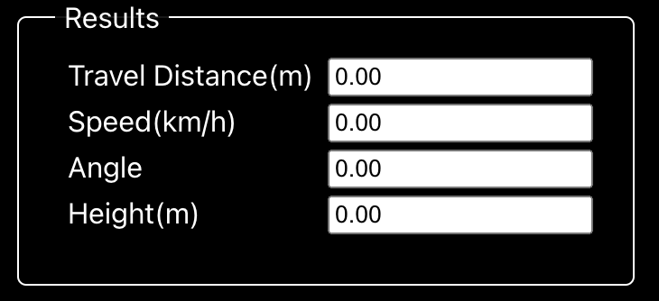
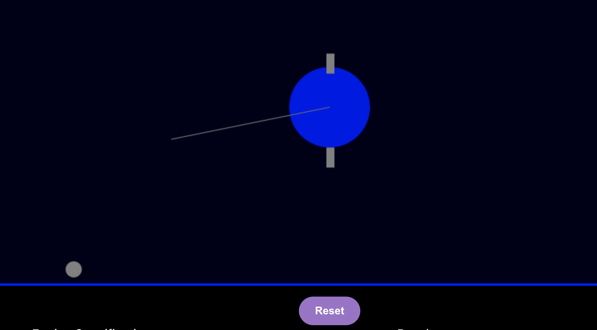
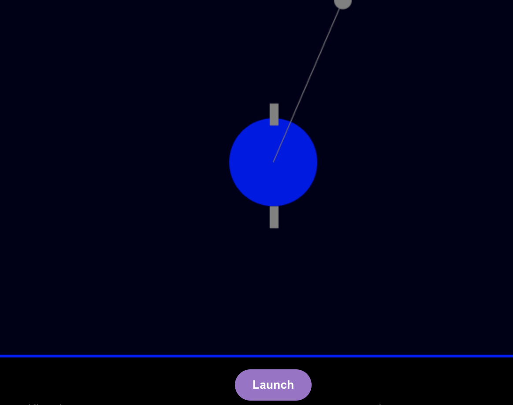

# Ball Lancher project

This project was bootstrapped with [Create React App](https://github.com/facebook/create-react-app).

## Architecture

This project consist in a simple SPA, constituted by:

1. **Main page:** Responsable to gather all application components.

2. **Canvas component:** Responsable for rendering the canvas where the animation it is going to be painted.

3. **useCanvas:** React Hook, where all the drawing and calculation logic is stored

4. **DomainContext:** React Context to share certain data and method though out the application components.

## How to use it

The application consist in two main sections:

1. Canvas for drawing the spinning arm and lanching the ball.

2. An action button that release the ball and reset the arm to start over again.

3. Engine specifications section, for specifing the torque, max speed and seconds to reach top speed of the tested engine.

4. Results section, where the Range of the through, angule and height are displayed.

 As soon as the web page load, it start spinning the arm by accelerating from 0 toward the top speed configured for the specific engine.

 When ever you hit the Launch button, the ball will be loose and the calculations are done.

 

 To start spinning the arm again, it is just a matter to hit again the button (now labeled Reset).

 

 When ever you start the engine (by clicking the Reset button), the parameters that are on the Engine specifications section will be pick up.

By default the engine specifications are:

**Torque:** 20 Nm
**Top Speed:** 20 km/h
**Second to Top Speed:** 10 seconds

## Video demostration

[screenshots/demoVideo.mov](https://github.com/standardbots-candidate/take-home-jose-mora/blob/main/screenshots/demoVideo.mov)
